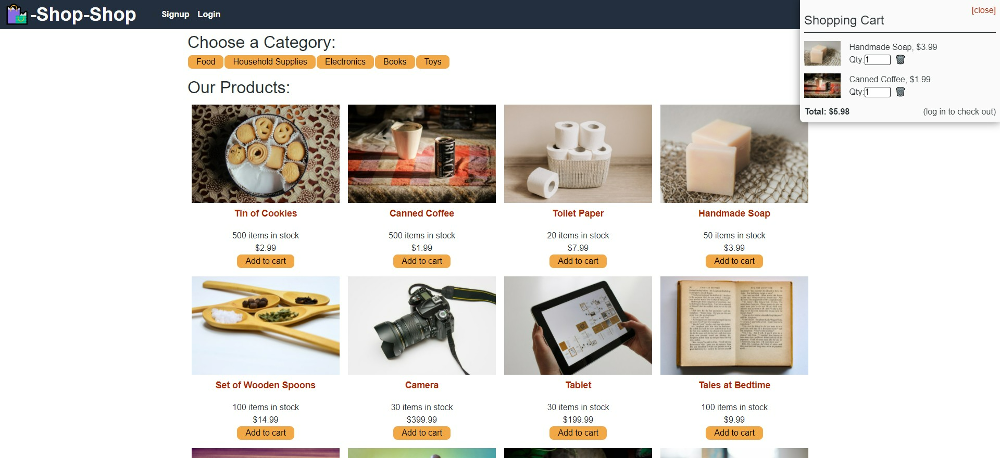

# Shop Shop 

## Description
Shop Shop is an e-commerce app that allows users to not only shop for various items, but saves their order history enabling them to come back and purchase an item at a later date. The shopper can add the products to the shopping cart and are able to manage it by increasing and decreasing the quatities. They checkout out and purchase their items through the Stripe API. The back-end of the application is built with Node.js, GraphQL, Apollo Server, and MongoDB. The front end uses React and Redux for state management. 

## Table of Contents (Optional)
* [Installation](#installation)
* [Usage](#usage)
* [Contributing](#contributing)
* [Questions](#questions)

## Installation
1. Clone the repository
2. From the root directory, run `npm install` to install all depencies at once
3. run `npm run develop` to start the client and server consecutively 

## Usage
This is what it will look like on your device. 

[Deployed Link](https://shopshope-commerce.herokuapp.com/)

## Contributing
University of Arizona and Jennifer Lucas

## Questions
Please checkout my [Github](https://github.com/jenmlucas) for other projects. If you have any other questions or concerns, feel free to email me at jenmlucas1@gmail.com.